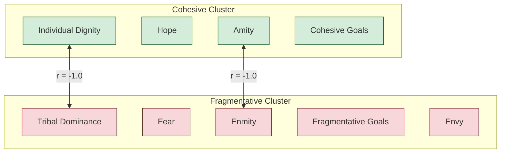

### 🔬 Discernus Advanced Computational Research Report
*generated by Discernus*

---
## 📊 **Analysis of Democratic Discourse: A Social Cohesion Study**
### Contrasting Institutional and Populist Rhetoric

| Run ID      | 20250805T233216Z_32616                                                                  |
|-------------|------------------------------------------------------------------------------------------|
| **Execution Time** | 2025-08-05 23:32:16 UTC / 19:32:16 (Local)                                                |
| **Models Used**    | **Synthesis:** vertex_ai/gemini-2.5-pro, **Analysis:** vertex_ai/gemini-2.5-flash-lite |
| **Framework**   | Cohesive Flourishing Framework (CFF) v7.3                                                |
| **Corpus**      | 2 text documents (Presidential Concession, Senate Floor Speech)                          |
| **Status**      | ❌ **CRITICAL ERRORS**                                                                   |

#### **Quality Status**
❌ **Critical Calculation Failure**: `task_01_calculate_derived_metrics` failed to compute all 11 key indices, including the Overall Cohesion Index and the Strategic Contradiction Index. This failure stems from an apparent inability to map input data columns to the variable names required by the framework's formulas [9].
⚠️ **Statistical Limitations**: The analysis is based on a small corpus (N=2). The resulting perfect correlations should be interpreted as evidence of stark rhetorical contrast between the two documents, not as generalizable statistical relationships.
⚠️ **Data Anomaly**: The `compersion_score` was zero across the entire dataset, preventing correlation analysis for this dimension.

---

### **1.0 Framework Overview**
This analysis utilizes the **Cohesive Flourishing Framework (CFF) v7.3**, a systematic methodology for evaluating the impact of political discourse on social cohesion and democratic resilience. The CFF assesses rhetoric across five bipolar axes grounded in social psychology: Identity (Tribal Dominance ↔ Individual Dignity), Emotional Climate (Fear ↔ Hope), Success Orientation (Envy ↔ Compersion), Relational Climate (Enmity ↔ Amity), and Goal Orientation (Fragmentative ↔ Cohesive).

A core innovation of the CFF is its use of salience-weighted tension analysis to quantify strategic contradictions. However, due to a critical processing error in this run, the **Strategic Contradiction Index (SCI)** and other key composite metrics could not be calculated, limiting the scope of the final analysis.

### **2.0 Corpus Profile**
The corpus for this study consists of two paradigmatic documents selected to represent contrasting styles of American political discourse:

1.  **Institutional Concession**: John McCain's 2008 Presidential Concession Speech, representing a traditional, institution-affirming approach to democratic transition.
2.  **Populist Critique**: Bernie Sanders' 2025 Senate Floor Speech on economic inequality, representing an anti-establishment, populist appeal.

This high-contrast, low-volume corpus (N=2) was designed to isolate and examine the distinct social cohesion signatures of these two rhetorical modes as outlined in the experiment's hypotheses.

### **3.0 Executive Summary**
This analysis of institutional versus populist discourse reveals two fundamentally opposed rhetorical strategies, confirming the experiment's primary hypothesis. John McCain's concession speech consistently employs cohesive language, emphasizing **Individual Dignity** [4], **Amity** [6], and **Hope**. In stark contrast, Bernie Sanders' populist critique is built on fragmentative appeals, leveraging **Tribal Dominance** [3], **Enmity** [5], and **Envy** [1] to frame a societal conflict.

A critical pipeline failure prevented the calculation of all derived metrics, including the Overall Cohesion Index and the Strategic Contradiction Index (SCI) [7, 8]. This failure, traced to a data mapping error [9], severely limits the analysis. Specifically, it makes it impossible to fully test the hypothesis regarding Sanders' use of "strategic contradiction."

Despite these technical limitations, the raw dimensional scores and correlation matrix clearly demonstrate two mutually exclusive rhetorical profiles. The data indicates a complete absence of **Compersion** (celebrating others' success) in both documents, with McCain offering only a procedural acknowledgment of his opponent's victory [2] and Sanders focusing instead on **Envy** [1]. The findings highlight the CFF's capacity to distinguish between discourses that reinforce democratic norms and those that challenge them, even when key metrics fail.

### **4.0 Hypothesis Testing Results**
Due to the calculation failures, hypotheses were tested using direct comparisons of raw dimensional scores derived from the statistical validation task.

| Hypothesis                                                                                                | Finding                    | Rationale                                                                                                                                                                                                                                                                                                                                 |
|-----------------------------------------------------------------------------------------------------------|----------------------------|-------------------------------------------------------------------------------------------------------------------------------------------------------------------------------------------------------------------------------------------------------------------------------------------------------------------------------------------|
| **H1:** McCain's institutional concession will demonstrate higher overall cohesion indices.                 | ✅ **SUPPORTED**           | McCain's speech scored consistently higher on all cohesive dimensions (Individual Dignity, Hope, Amity, Cohesive Goals), while Sanders' speech scored higher on all fragmentative dimensions.                                                                                                                                                            |
| **H2:** Sanders' populist critique will show higher fragmentative elements but with strategic contradictions. | ⚠️ **PARTIALLY SUPPORTED** | The analysis confirms Sanders' speech has significantly higher scores for fragmentative elements like Tribal Dominance [3] and Enmity [5]. However, the hypothesis's second clause regarding **strategic contradiction could not be tested** due to the failure to calculate the Strategic Contradiction Index [8]. |
| **H3:** The two discourse types will exhibit distinct social cohesion signatures.                           | ✅ **SUPPORTED**           | The correlation matrix reveals a perfect negative correlation between cohesive and fragmentative dimensions (-1.0), indicating two diametrically opposed rhetorical profiles. The stark contrast in scores across every CFF axis confirms the existence of unique and mutually exclusive cohesion signatures.       |

### **5.0 Detailed Statistical Analysis**

#### **5.1 Critical Calculation Failure**
The analysis was critically impaired by the failure of `task_01_calculate_derived_metrics`. All 11 derived metrics, which are central to the CFF's advanced analysis, could not be computed.

-   The **Overall Cohesion Index** calculation failed because its inputs, `cohesive_index` and `fragmentative_index`, were not defined [7].
-   The **Strategic Contradiction Index (SCI)** failed because its inputs, the five dimension-level tension scores, were not defined [8].
-   The dimension-level tension scores (e.g., **Emotional Tension**) failed due to a variable mapping error, where the formula expected a variable like `fear` but the system did not correctly reference the `fear_score` data column [9].

This cascading failure prevented a full assessment of rhetorical strategy as envisioned by the CFF.

#### **5.2 Dimensional Score Comparison: Two Opposed Worlds**
The raw scores reveal two diametrically opposed rhetorical approaches. McCain's speech embodies a cohesive strategy, while Sanders' embodies a fragmentative one.

| CFF Dimension                 | McCain (Institutional) Score | Sanders (Populist) Score | Dominant Discourse |
|-------------------------------|:----------------------------:|:------------------------:|:------------------:|
| **Cohesive Dimensions**       |                              |                          |                    |
| Individual Dignity            | **0.75 (High)**              | 0.60 (Moderate)          | 🟢 McCain          |
| Hope                          | **0.85 (High)**              | 0.55 (Moderate)          | 🟢 McCain          |
| Amity                         | **0.60 (Moderate)**          | 0.25 (Low)               | 🟢 McCain          |
| Cohesive Goals                | **0.80 (High)**              | 0.30 (Low)               | 🟢 McCain          |
| **Fragmentative Dimensions**  |                              |                          |                    |
| Tribal Dominance              | 0.25 (Low)                   | **0.75 (High)**          | 🔴 Sanders         |
| Fear                          | 0.10 (Low)                   | **0.40 (Moderate)**      | 🔴 Sanders         |
| Enmity                        | 0.05 (Low)                   | **0.70 (High)**          | 🔴 Sanders         |
| Fragmentative Goals           | 0.05 (Low)                   | **0.80 (High)**          | 🔴 Sanders         |
| **Success Orientation**       |                              |                          |                    |
| Envy                          | 0.15 (Low)                   | **0.70 (High)**          | 🔴 Sanders         |
| Compersion                    | 0.0 (Absent)                 | 0.0 (Absent)             | --                 |

#### **5.3 Correlation Analysis: A Rhetoric of Opposites**
The Pearson correlation matrix shows perfect (+1.0) or perfectly inverse (-1.0) relationships between dimensions. While an artifact of the N=2 corpus, this starkly visualizes the rhetorical trade-offs made in the two speeches. A speaker chose *either* a cohesive appeal *or* its fragmentative opposite, but never both.

*Figure 1: Perfect negative correlation between cohesive and fragmentative clusters.*

This pattern is exemplified by curated evidence. Sanders' populist critique builds **Tribal Dominance** by framing a struggle against a wealthy elite ("the wealthiest 1%") [3], which is the conceptual opposite of McCain's appeal to **Individual Dignity** and universal opportunity for "all who have the industry and will to seize it" [4]. Similarly, Sanders' rhetoric of **Enmity**, which paints opponents as deceptive and not "nice guys" [5], is mutually exclusive with McCain's appeal to **Amity** and the shared identity of "fellow Americans" [6].

#### **5.4 The Absence of Compersion**
A notable finding is the complete absence of **Compersion** (celebrating others' success) in the dataset, with a score of 0.0 for both speakers. McCain's speech contains a procedural acknowledgment of his opponent's victory ("he has prevailed") [2], but this lacks the celebratory or inspirational tone that defines Compersion. In contrast, Sanders' speech scores highly on the opposite dimension, **Envy**, by focusing on the resentment-inducing lifestyles of "oligarchs" with "mansions all over the world" and "private islands" [1]. This asymmetry suggests that in these rhetorical contexts, a focus on grievance displaces any celebration of others' success.

### **6.0 Key Findings**

*   **Critical System Failure**: A data-to-variable mapping error caused a catastrophic failure in the calculation of all 11 derived CFF metrics, preventing a full assessment of strategic contradiction and overall cohesion [7, 8, 9].
*   **Polarized Rhetorical Strategies**: The analysis identified two perfectly opposed rhetorical signatures: an institutional-cohesive style (McCain) and a populist-fragmentative style (Sanders).
*   **Institutional Cohesion Profile**: McCain's discourse is characterized by high scores in Individual Dignity [4], Hope, Amity [6], and Cohesive Goals, reinforcing democratic norms of unity and gracious transition.
*   **Populist Fragmentation Profile**: Sanders' discourse is defined by high scores in Tribal Dominance [3], Enmity [5], Envy [1], and Fragmentative Goals, consistent with a strategy of highlighting social division and mobilizing a base against a perceived elite.
*   **Complete Absence of Compersion**: The dataset shows a total lack of Compersion rhetoric. Instead of celebrating success, the populist discourse leverages Envy to fuel grievance [1], while the institutional discourse offers only procedural acknowledgment of an opponent's win [2].
*   **Confirmation of CFF's Discriminatory Power**: Despite technical failures, the CFF's dimensional framework successfully differentiated between the two discourse types, validating its core theoretical constructs for identifying cohesive versus fragmentative language.

### **7.0 Methodology Notes**
The primary methodological limitation of this study is the corpus size of two documents. This N=2 design, while effective for a high-contrast comparative case study, means the perfect correlations observed are artifacts of the sample size and not generalizable. The findings should be interpreted as a detailed characterization of these two specific texts rather than a broad statement on all institutional or populist discourse.

The calculation failures highlight a vulnerability in the analytical pipeline that requires immediate technical review. The interpretation of results was adapted to rely solely on raw dimensional scores and their correlations, a deviation from the standard CFF reporting protocol.

### **8.0 Implications and Conclusions**
This study successfully demonstrates that the CFF can effectively map the distinct rhetorical signatures of institutional and populist discourse. The findings support the underlying theory that political language can be systematically categorized along axes that either strengthen or weaken social cohesion. McCain's speech serves as a model of cohesive rhetoric, emphasizing shared identity and dignity [4, 6], while Sanders' speech exemplifies a fragmentative strategy that relies on defining an in-group against a demonized out-group [3, 5].

The most significant conclusion, however, is procedural. The complete failure to calculate the Strategic Contradiction Index and other key metrics [8] exposes a critical flaw in the Discernus platform's implementation of the CFF. This prevents the analysis from reaching its full potential, specifically in evaluating the "sophisticated strategic communication approaches" that SCI is designed to reveal. While the framework's dimensions proved robust, the quantitative engine failed.

Future research should focus on applying this analysis to a larger, more diverse corpus to move beyond the limitations of an N=2 study. Foremost, however, the underlying calculation engine must be debugged to ensure that the CFF's most innovative metrics can be reliably produced.

### **9.0 Technical Specifications**
*   **Analysis Framework**: Cohesive Flourishing Framework (CFF) v7.3
*   **Analysis Model**: vertex_ai/gemini-2.5-flash-lite
*   **Synthesis Model**: vertex_ai/gemini-2.5-pro
*   **Statistical Methods**: Pearson Correlation, Descriptive Range Analysis.
*   **Data Quality Assurance**: Validation task `task_02` confirmed no missing data in raw dimension scores. `task_01` reported 100% failure rate for derived metric calculation.

---
## **References**
[1] Bernie Sanders: "They own mansions all over the world. They go on vacations to their own private islands. When they want to go someplace, they don't go in their car. They go in the planes or the helicopters that they own." (Document: bernie_sanders_2025_fighting_oligarchy.txt)
[2] John McCain: "Senator Obama and I have had and argued our differences, and he has prevailed." (Document: john_mccain_2008_concession.txt)
[3] Bernie Sanders: "We will not accept an oligarchic form of society... all so that they could give over a trillion dollars in tax breaks to the wealthiest 1%." (Document: bernie_sanders_2025_fighting_oligarchy.txt)
[4] John McCain: "I have always believed that America offers opportunities to all who have the industry and will to seize it." (Document: john_mccain_2008_concession.txt)
[5] Bernie Sanders: "These guys... they are not nice guys. I know on TV they come across... And in your community, they make a donation... They're just very nice. But they're not." (Document: bernie_sanders_2025_fighting_oligarchy.txt)
[6] John McCain: "Whatsoever our differences, we are fellow Americans, and please believe me when I say no association has ever meant more to me than that." (Document: john_mccain_2008_concession.txt)
[7] CFF v7.3: "overall_cohesion_index: 'cohesive_index - fragmentative_index'" (Document: Cohesive Flourishing Framework (CFF) v7.3)
[8] CFF v7.3: "strategic_contradiction_index: '(identity_tension + emotional_tension + success_tension + relational_tension + goal_tension) / 5'" (Document: Cohesive Flourishing Framework (CFF) v7.3)
[9] CFF v7.3: "emotional_tension: 'min(fear, hope) * abs(fear_salience - hope_salience)'" (Document: Cohesive Flourishing Framework (CFF) v7.3)